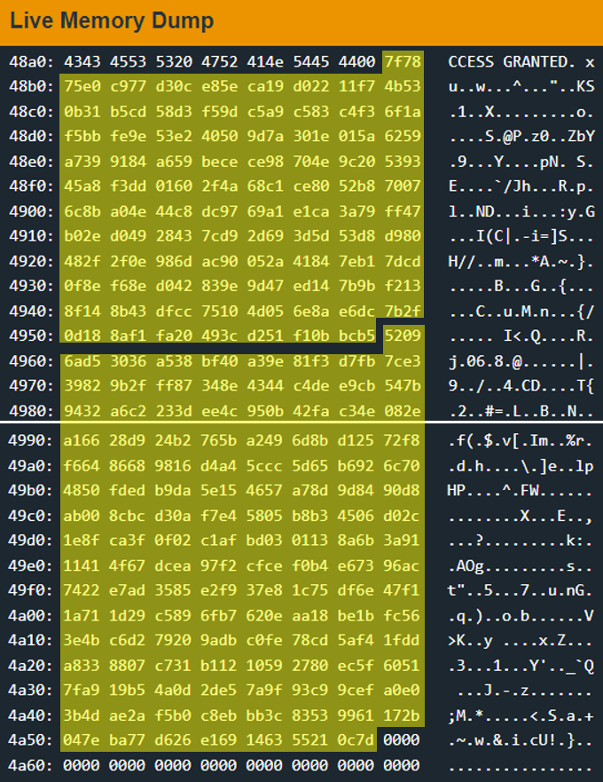

# North America

## Tutorial (10 pts)
## New Orleans (10 pts)
`447e: <create_password>` creates the same static password at address `0x2400` every time it runs
`44b2: <get_password>` gets a password from the user and stores it at address `0x439b`
`44bc: <check_password>` checks the entered password stored in memory to the actual byte by byte
Solution: - Not the same thing every time. First, run the program up to the `<get_password>` function. When it asks for input, press wait, and look at the value in `0x2400`

## Vancouver (10 pts)
`443e: <main>`
* sets `r13` to 0x400
* clears `r14`
* sets `r15` to 0x2400
* calls `<memset>`
* sets `r14` to 0x3ff
* sets `r15` to 0x2400 again
* gets the debug payload from the user and stores it at 0x2400
* effectively stores first two bytes of payload in `r11`
	* gets whatever the first byte of the payload is, stores it in `r11`, and swaps the high order byte with the low order byte (0x0074 -> 0x7400)
	* takes the second byte of the payload and stores it in `r15`
	* ORs together `r11` and `r15` and stores it in `r11`
* if 3rd byte of payload is < 2, the payload is invalid. Otherwise, it executes
	* stores 3rd byte of payload and stores it in `r10`
	* if `r10` - 0x2 < 0, jump to `0x4486`
* store 3rd byte of payload (`r10`) in `r13`
* store address of 4th byte of payload in `r14`
* store first 2 bytes of payload in `r15`
* call `<memcpy>`
* Finally, call the program at address in `r11` (First 2 bytes of payload)
`450e: <memset>` Not positive yet what this does
`44fc: <memcpy>`
* `r12` - byte 1+2, payload start address
* `r13` - byte 3, program length
* `r14` - byte 4, first byte of program
* Assembly logic:
	* store the 2 bytes of payload in `r15` in `r12`
	* jump to `0x4508`
	* if value in `r13` is not 0, go to `0x4500`
	* move the next byte of the payload into the address in `r12`, then increment `r12` and `r14`
	* decrement `r13`
PoC: Replace first .string with HELLO, WORLD!: `45 7a 0d 48 45 4c 4c 4f 2c 20 57 4f 52 4c 44 21`

We know that it inserts the code into whatever part of memory it's told and runs it, so we just need to write instructions that open the lock. In the manual, we can see several interrupts, including `0x7f`, which interfaces with the deadbolt to trigger an unlock. We can use the [disassembler/assembler](https://microcorruption.com/assembler) on the website to see that this code to send an unlock interrupt:
```
push #0x7f
call #0x44a8
```
Translates to this: `30127f00b012a844`
If we add that on to an acceptable "header" (two byte address+length), we get this: `80003030127f00b012a844`, which unlocks the door.

## Cold Lake


## Halifax


# Asia

## Baku

### Explore the Code
Here's the main function, let's translate it to C:
```
443e <main>
443e:  3150 f0ff      add	#0xfff0, sp
4442:  3d40 1000      mov	#0x10, r13
4446:  0e43           clr	r14
4448:  0f41           mov	sp, r15
444a:  b012 0e48      call	#0x480e <memset>
444e:  3f40 7a48      mov	#0x487a "SCAN SECURITY DEVICE", r15
4452:  b012 d644      call	#0x44d6 <puts>
4456:  3e40 1000      mov	#0x10, r14
445a:  0f41           mov	sp, r15
445c:  b012 b844      call	#0x44b8 <getsn>
4460:  0e41           mov	sp, r14
4462:  3f40 ae48      mov	#0x48ae "\x7fxuw\x0c^\x19     ", r15
4466:  b012 fa46      call	#0x46fa <aes_ecb_decrypt>
446a:  3d40 1000      mov	#0x10, r13
446e:  0e41           mov	sp, r14
4470:  3f40 8f48      mov	#0x488f "ACCESS GRANTED!", r15
4474:  b012 ee47      call	#0x47ee <memcmp>
4478:  0f93           tst	r15
447a:  e923           jnz	$-0x2c <main+0x10>
447c:  3f40 9f48      mov	#0x489f "ACCESS GRANTED", r15
4480:  b012 d644      call	#0x44d6 <puts>
4484:  0312           push	#0x0
4486:  0312           push	#0x0
4488:  3012 7f00      push	#0x7f
448c:  b012 a044      call	#0x44a0 <INT>
4490:  0f43           clr	r15
4492:  3150 1600      add	#0x16, sp
```

In C code:
```c
void main()
{
    char password[0x10];

    //clean up memory
    memset(password, 0, 0x10);

start:
    // get password to decrypt
    puts("SCAN SECURITY DEVICE");
    gensn(password, 0x10);

    // decrypt password
    aes_ecb_decrypt(0x48ae, password)

    if(memcmp("ACCESS GRANTED!", password, 0x10))
        goto start;

    puts("ACCESS GRANTED");
    INT(0x7f); //interrupt to open door
}
```
(I was following [a guide](https://github.com/SimchaTeich/Microcorruption/tree/main/22%20-%20Baku) at this point) First we need to look at the data at `0x48ae` in memory. We see this:


Which contains two important things:
1 - 11 sequences of length `0x10`
2 - The "Famous inverse s-box table"

The fact that the `aes_ecb_decrypt` function receives a pointer to these 11 sequences mean they're probably keys. So if we find the encrypted bytes of the string "ACCESS GRANTED", we should open the door.

#### Detour - Rijndael S-box
I had to look this up, because it said "famous", and I had no idea what it was talking about.
Essentially, the Rijndael S-box (and inverse s-box) is a lookup table used in the Rijndael cipher, which is what the AES algorithm is based on. From what I can tell, the s-box is used for encryption, and the inverse s-box is used for decryption.
I don't really 100% understand what the terminology means, but when using this cipher, the s-box maps an 8-bit input, $c$, to an 8-bit output, $s = S(c)$. 
I don't really have to know how the encryption/decryption works, but it's probably a good idea to be able to recognize an s-box or inverse s-box when I see them, because it probably means I'm working with AES encryption.

### The Exploit
Basically, from what we know from analyzing memory, we need code for AES ECB encryption using 11 keys. Once we have that code, we can encrypt "ACCESS GRANTED!", then use that as input for decryption. 

First, let's ask AI for an decryption program and see if the output of that program matches output of the door program 

```python
# dec.py

from Crypto.Cipher import AES

# Inverse S-Box
inv_s_box = [
    0x52, 0x09, 0x6A, 0xD5, 0x30, 0x36, 0xA5, 0x38, 0xBF, 0x40, 0xA3, 0x9E, 0x81, 0xF3, 0xD7, 0xFB,
    0x7C, 0xE3, 0x39, 0x82, 0x9B, 0x2F, 0xFF, 0x87, 0x34, 0x8E, 0x43, 0x44, 0xC4, 0xDE, 0xE9, 0xCB,
    0x54, 0x7B, 0x94, 0x32, 0xA6, 0xC2, 0x23, 0x3D, 0xEE, 0x4C, 0x95, 0x0B, 0x42, 0xFA, 0xC3, 0x4E,
    0x08, 0x2E, 0xA1, 0x66, 0x28, 0xD9, 0x24, 0xB2, 0x76, 0x5B, 0xA2, 0x49, 0x6D, 0x8B, 0xD1, 0x25,
    0x72, 0xF8, 0xF6, 0x64, 0x86, 0x68, 0x98, 0x16, 0xD4, 0xA4, 0x5C, 0xCC, 0x5D, 0x65, 0xB6, 0x92,
    0x6C, 0x70, 0x48, 0x50, 0xFD, 0xED, 0xB9, 0xDA, 0x5E, 0x15, 0x46, 0x57, 0xA7, 0x8D, 0x9D, 0x84,
    0x90, 0xD8, 0xAB, 0x00, 0x8C, 0xBC, 0xD3, 0x0A, 0xF7, 0xE4, 0x58, 0x05, 0xB8, 0xB3, 0x45, 0x06,
    0xD0, 0x2C, 0x1E, 0x8F, 0xCA, 0x3F, 0x0F, 0x02, 0xC1, 0xAF, 0xBD, 0x03, 0x01, 0x13, 0x8A, 0x6B,
    0x3A, 0x91, 0x11, 0x41, 0x4F, 0x67, 0xDC, 0xEA, 0x97, 0xF2, 0xCF, 0xCE, 0xF0, 0xB4, 0xE6, 0x73,
    0x96, 0xAC, 0x74, 0x22, 0xE7, 0xAD, 0x35, 0x85, 0xE2, 0xF9, 0x37, 0xE8, 0x1C, 0x75, 0xDF, 0x6E,
    0x47, 0xF1, 0x1A, 0x71, 0x1D, 0x29, 0xC5, 0x89, 0x6F, 0xB7, 0x62, 0x0E, 0xAA, 0x18, 0xBE, 0x1B,
    0xFC, 0x56, 0x3E, 0x4B, 0xC6, 0xD2, 0x79, 0x20, 0x9A, 0xDB, 0xC0, 0xFE, 0x78, 0xCD, 0x5A, 0xF4,
    0x1F, 0xDD, 0xA8, 0x33, 0x88, 0x07, 0xC7, 0x31, 0xB1, 0x12, 0x10, 0x59, 0x27, 0x80, 0xEC, 0x5F,
    0x60, 0x51, 0x7F, 0xA9, 0x19, 0xB5, 0x4A, 0x0D, 0x2D, 0xE5, 0x7A, 0x9F, 0x93, 0xC9, 0x9C, 0xEF,
    0xA0, 0xE0, 0x3B, 0x4D, 0xAE, 0x2A, 0xF5, 0xB0, 0xC8, 0xEB, 0xBB, 0x3C, 0x83, 0x53, 0x99, 0x61,
    0x17, 0x2B, 0x04, 0x7E, 0xBA, 0x77, 0xD6, 0x26, 0xE1, 0x69, 0x14, 0x63, 0x55, 0x21, 0x0C, 0x7D,
]

# 11 keys of size 16 bytes
keys = [
    b'\x7F\x78\x75\xE0\xC9\x77\xD3\x0C\xE8\x5E\xCA\x19\xD0\x22\x11\xF7',
    b'\x4B\x53\x0B\x31\xB5\xCD\x58\xD3\xF5\x9D\xC5\xA9\xC5\x83\xC4\xF3',
    b'\x6F\x1A\xF5\xBB\xFE\x9E\x53\xE2\x40\x50\x9D\x7A\x30\x1E\x01\x5A',
    b'\x62\x59\xA7\x39\x91\x84\xA6\x59\xBE\xCE\xCE\x98\x70\x4E\x9C\x20',
    b'\x53\x93\x45\xA8\xF3\xDD\x01\x60\x2F\x4A\x68\xC1\xCE\x80\x52\xB8',
    b'\x70\x07\x6C\x8B\xA0\x4E\x44\xC8\xDC\x97\x69\xA1\xE1\xCA\x3A\x79',
    b'\xFF\x47\xB0\x2E\xD0\x49\x28\x43\x7C\xD9\x2D\x69\x3D\x5D\x53\xD8',
    b'\xD9\x80\x48\x2F\x2F\x0E\x98\x6D\xAC\x90\x05\x2A\x41\x84\x7E\xB1',
    b'\x7D\xCD\x0F\x8E\xF6\x8E\xD0\x42\x83\x9E\x9D\x47\xED\x14\x7B\x9B',
    b'\xF2\x13\x8F\x14\x8B\x43\xDF\xCC\x75\x10\x4D\x05\x6E\x8A\xE6\xDC',
    b'\x7B\x2F\x0D\x18\x8A\xF1\xFA\x20\x49\x3C\xD2\x51\xF1\x0B\xBC\xB5'
][::-1]

# AES block size (in bytes)
block_size = 16

def inverse_s_box(sub_bytes):
    # Perform inverse substitution using the inverse S-Box
    return bytes(inv_s_box[b] for b in sub_bytes)

def decrypt_aes_ecb(ciphertext, keys):
    # Create an AES object with ECB mode (no padding)
    cipher = AES.new(keys[0], AES.MODE_ECB)

    # Decrypt the first block
    plaintext = cipher.decrypt(ciphertext[:block_size])

    # Perform inverse round transformation for subsequent blocks
    for i in range(1, len(ciphertext) // block_size):
        ciphertext_block = ciphertext[i * block_size:(i + 1) * block_size]
        decrypted_block = inverse_s_box(cipher.decrypt(ciphertext_block))

        # XOR decrypted block with the corresponding key
        plaintext_block = bytes(d ^ k for (d, k) in zip(decrypted_block, keys[i]))

        plaintext += plaintext_block

    return plaintext

# Test decryption
ciphertext = b'\x00\x00\x00\x00\x00\x00\x00\x00\x00\x00\x00\x00\x00\x00\x00\x00'  # Replace with your actual ciphertext
plaintext = decrypt_aes_ecb(ciphertext, keys)
print(plaintext)
```


# Australia

## Sydney